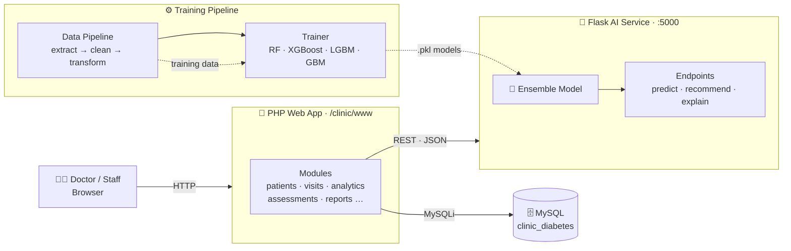

<div align="center">

# 🩺 Diabetes Clinic Management System

### نظام إدارة عيادة السكري

**A modern, bilingual (Arabic / RTL-first) clinic management platform with an AI-powered
prediction engine for diabetic wound healing & patient risk — built with PHP, MySQL,
Flask & Machine Learning.**

[](https://www.php.net/)
[](https://www.mysql.com/)
[](https://www.python.org/)
[](https://flask.palletsprojects.com/)
[](https://scikit-learn.org/)
[](https://xgboost.ai/)

[](#-getting-started)
[](#-getting-started)
[](#-ai-api-reference)
[](#-contributing)

---

**Quick Links** —
[✨ Features](#-features) ·
[🏗️ Architecture](#-architecture) ·
[🚀 Getting Started](#-getting-started) ·
[🔌 API Reference](#-ai-api-reference) ·
[🧠 AI Engine](#-ai-engine) ·
[👨‍💻 Developer](#-developer)

</div>

---

## 📸 Preview

> 🖼️ *Screenshots coming soon — star ⭐ the repo to get notified!*

| 🌞 Light Mode | 🌙 Dark Mode |
| :---: | :---: |
| *Dashboard screenshot placeholder* | *Dark theme screenshot placeholder* |

---

## ✨ Features

<table>
<tr>
<td width="50%" valign="top">

### 👥 Patient Care
- 📋 **Full patient profiles** — demographics, files, photos & medical history
- 🩺 **Visit management** — vitals, blood sugar, labs, complications, treatments
- 🦶 **Foot exams** with an interactive **foot canvas** annotation tool
- 💊 **Medications & lab test orders** tracking

</td>
<td width="50%" valign="top">

### 🤖 Artificial Intelligence
- ⚠️ **Risk prediction** — ensemble ML models flag high-risk patients
- 🩹 **Wound healing estimation** — predicted healing duration
- 💡 **Auto-generated treatment & nutrition recommendations**
- 📖 **Explainable AI** — understand what drives every prediction

</td>
</tr>
<tr>
<td width="50%" valign="top">

### 📊 Analytics & Reporting
- 📈 **20+ analytics modules** — trends, cohorts, quality measures, doctor performance
- 🗺️ Geographic & visit-pattern insights
- 🧾 **PDF reports** — patient, monthly & full clinic reports
- 🔔 Smart risk alerts & notification center

</td>
<td width="50%" valign="top">

### 🛡️ Platform & UX
- 🌍 **Bilingual Arabic/English** — RTL-first design
- 🌙 **Dark mode** toggle
- 🔐 Role-based access (`super_admin`, `admin`, `doctor`, `medical_assistant`, `nurse`)
- 💾 Automated DB backups & email report cron jobs
- 📚 Patient education library with file uploads

</td>
</tr>
</table>

---

## 🏗️ Architecture



---

## 🧰 Tech Stack

| Layer | Technologies |
| :--- | :--- |
| 🎨 **Frontend** | HTML5, CSS3 (custom, RTL), Vanilla JS, Chart.js, Canvas API |
| 🐘 **Backend** | PHP 8+, prepared statements, session-based auth, CSRF tokens |
| 🗄️ **Database** | MySQL / MariaDB (`utf8mb4` — full Arabic support) |
| 🐍 **AI Service** | Python 3.10+, Flask, Flask-CORS |
| 🤖 **Machine Learning** | scikit-learn (Random Forest, GBM, calibrated), XGBoost, LightGBM, joblib |
| 🔄 **Data Pipeline** | pandas, SQLAlchemy, PyMySQL |
| 🖥️ **Runtime** | XAMPP (Apache + PHP + MySQL), Windows batch launchers |

---

## 📂 Project Structure

```text
clinic/
├── 📁 www/                      # 🐘 PHP web application (docroot)
│   ├── api/                     #    Internal JSON endpoints
│   ├── assets/                  #    CSS, JS, Chart.js, foot-canvas
│   ├── config/                  #    DB, session, helpers, constants
│   ├── cron/                    #    ⏰ auto_backup, send_reports
│   ├── includes/                #    header, sidebar, auth, AI client
│   ├── modules/                 #    Feature modules (13 domains)
│   │   ├── ai/                  #      🤖 AI dashboard & analysis
│   │   ├── analytics/           #      📈 20+ analytics views
│   │   ├── assessments/         #      🦶 foot exams, care plans
│   │   ├── patients/ visits/    #      👥 core clinical modules
│   │   └── …                    #      labs, meds, education, users
│   ├── uploads/                 #    📷 patient photos & files (gitignored)
│   ├── install.php              #    ⚙️ One-click DB installer
│   └── index.php                #    Entry point
├── 📁 ai_api/                   # 🐍 Flask AI microservice
│   ├── app.py                   #    REST endpoints (:5000)
│   ├── models/                  #    Trained .pkl models
│   └── requirements.txt
├── 📁 ai_engine/                # 🧠 ML core — predictors & trainer
├── 📁 data_pipeline/            # 🔄 Extract → clean → transform
├── 🚀 start_ai.bat              # Start AI service (one click)
├── 🚀 train_and_start_ai.bat    # Train models + start (one click)
└── 📄 generate_synthetic_data.py
```

---

## 🚀 Getting Started

### 📋 Prerequisites

| Requirement | Version | Notes |
| :--- | :--- | :--- |
| 🟠 [XAMPP](https://www.apachefriends.org/) | any recent | Provides Apache, PHP 8+ & MySQL |
| 🐍 [Python](https://www.python.org/downloads/) | 3.10+ | Only needed for the AI features |
| 🌐 Browser | any | Chrome / Edge / Firefox |

> 💡 **No AI? No problem.** The web app runs fully standalone — AI predictions
> gracefully fall back to rule-based logic when the Python service is offline.

### 🛠️ Installation

**1️⃣ Clone the repository**

```bash
git clone https://github.com/msimoo/his-clinic-lab.git
# → place it so the final path is:  C:\xampp\htdocs\clinic\
```

**2️⃣ Start services** — open the **XAMPP Control Panel** and start **Apache** 🟢 and **MySQL** 🟢.

**3️⃣ Run the database installer** — open in your browser:

```text
http://localhost/clinic/www/install.php
```

✅ This creates the `clinic_diabetes` database (UTF-8MB4), all tables, and a default admin.
⚠️ **Delete or secure `install.php` after installation!**

**4️⃣ Log in** to the system:

```text
http://localhost/clinic/www/
```

| 👤 Username | 🔑 Password |
| :---: | :---: |
| `admin` | `admin123` |

> 🚨 **Change the default password immediately** (Profile → Change Password).

### 🤖 Optional — AI Prediction Service

**One-click (Windows):**

```bash
:: Train models from DB data, then start the server
train_and_start_ai.bat

:: Or just start with previously trained models
start_ai.bat
```

**Manual setup:**

```bash
# 1 · Install dependencies
cd ai_api
pip install -r requirements.txt

# 2 · Build the training dataset from MySQL
python -m data_pipeline.main

# 3 · Train the ML models (RF · XGBoost · LGBM · GBM)
python -m ai_engine.trainer

# 4 · Launch the Flask API on http://127.0.0.1:5000
python ai_api/app.py
```

✅ Verify it's alive → <http://127.0.0.1:5000/api/health>

### ⏰ Scheduled Jobs (optional)

| Script | Purpose | Suggested schedule |
| :--- | :--- | :--- |
| `www/cron/auto_backup.php` | 💾 Automatic database backups | daily |
| `www/cron/send_reports.php` | 📧 Email scheduled reports | weekly |

---

## 🔌 AI API Reference

Base URL: `http://127.0.0.1:5000` · Content type: `application/json`

| Method | Endpoint | Description |
| :---: | :--- | :--- |
| `GET` | `/api/health` | 💚 Service health & model load status |
| `POST` | `/api/predict/risk` | ⚠️ Patient complication risk score |
| `POST` | `/api/predict/healing` | 🩹 Estimated wound healing duration |
| `POST` | `/api/recommend` | 💡 Treatment & nutrition recommendations |
| `POST` | `/api/analyze` | 🔍 Full clinical analysis |
| `POST` | `/api/explain` | 📖 Explanation of prediction factors |

```bash
# Example — check service health
curl http://127.0.0.1:5000/api/health
```

> 🧠 If model files are missing, endpoints respond using **rule-based fallbacks**
> instead of failing — safe for demos and development.

---

## 🧠 AI Engine

| Model family | Algorithms | Purpose |
| :--- | :--- | :--- |
| ⚠️ **Risk predictor** | Random Forest · XGBoost · LightGBM → calibrated ensemble | Flags patients at high risk of complications |
| 🩹 **Healing estimator** | Random Forest · GBM · LightGBM ensemble | Predicts wound healing duration |

**Pipeline:** `MySQL → data_pipeline (extract · clean · transform) → ai_engine.trainer → .pkl models → Flask ensemble API → PHP dashboard`

---

## 🗺️ Roadmap

- [x] 🏥 Core clinical modules (patients, visits, assessments)
- [x] 🤖 ML risk & healing prediction with ensemble models
- [x] 📊 Analytics suite & PDF reporting
- [x] 🌙 Dark mode & bilingual RTL UI
- [ ] 📱 Mobile-responsive PWA
- [ ] 🌐 Full English UI parity
- [ ] 🔬 Model monitoring & retraining dashboard
- [ ] ☁️ Docker deployment (`docker-compose`)

---

## 🤝 Contributing

Contributions are what make open source amazing! 💙

```bash
# 1 · Fork the repo
# 2 · Create your feature branch
git checkout -b feature/amazing-feature

# 3 · Commit your changes
git commit -m "✨ Add amazing feature"

# 4 · Push and open a Pull Request 🎉
git push origin feature/amazing-feature
```

---

## 👨‍💻 Developer

<div align="center">

<table>
<tr>
<td align="center" width="220">

<br/>

### **Mohammed Omer**
*Creator & Lead Developer*

[](https://github.com/msimoo)
[](mailto:elsamaniomer@gmail.com)

</td>
<td align="left" valign="middle">

💬 **Questions or feedback?** Don't hesitate to reach out!

- 🐛 Found a bug? → [Open an issue](https://github.com/msimoo/his-clinic-lab/issues)
- 💡 Have an idea? → [Start a discussion](https://github.com/msimoo/his-clinic-lab/pulls)
- 📬 Direct contact → [elsamaniomer@gmail.com](mailto:elsamaniomer@gmail.com)

*Building healthcare technology that speaks Arabic first — and thinks with AI.* 🇸🇩

</td>
</tr>
</table>

</div>

---

<div align="center">

**⭐ Found this project useful? Give it a star on GitHub!** ⭐

<sub>Built with ❤️ and ☕ by **Mohammed Omer** · © 2026 Diabetes Clinic Management System</sub>

<sub>🩺 *Disclaimer: for clinical decision support only — not a substitute for professional medical judgment.*</sub>

</div>


