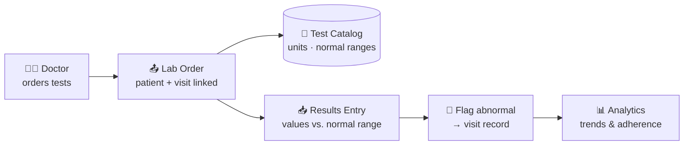
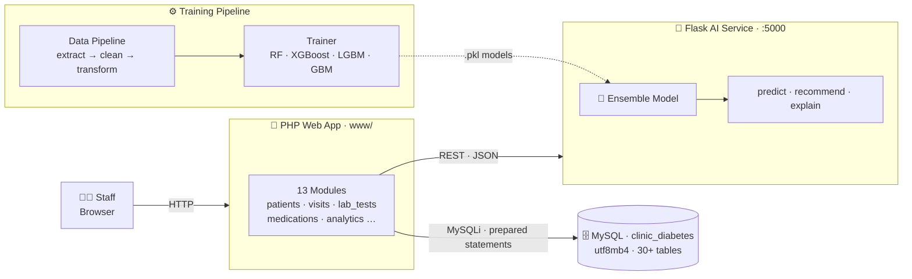

<div align="center">

# 🏥 HIS — Clinic & Laboratory Management System

### نظام إدارة عيادة ومختبر السكري والغدد الصماء

**A complete Hospital Information System for an Endocrinology & Diabetes Center —
patients, visits, laboratory (LIS), pharmacy, AI clinical decision support, and
24+ analytics modules. Bilingual Arabic/RTL · PHP · MySQL · Flask · Machine Learning.**

[](https://www.php.net/)
[](https://www.mysql.com/)
[](https://www.python.org/)
[](https://flask.palletsprojects.com/)
[](https://scikit-learn.org/)
[](https://xgboost.ai/)
[](https://www.chartjs.org/)

[](#-modules)
[](#-modules)
[](#-ai-api-reference)
[](#-license)

**Quick Links** —
[✨ Modules](#-modules) ·
[🧪 Laboratory (LIS)](#-laboratory-lis) ·
[🏗️ Architecture](#️-architecture) ·
[🚀 Getting Started](#-getting-started) ·
[🔌 AI API](#-ai-api-reference) ·
[👨‍💻 Developer](#-developer)

</div>

---

## 🌟 Overview

**HIS Clinic Lab** is a production-grade **Hospital Information System** built for
**مركز سري للغدد الصماء والسكري** (Sirri Center for Endocrinology & Diabetes) —
covering the full patient journey in one platform:

```text
📝 Register → 🩺 Visit & Diagnose → 🧪 Order Lab Tests → 🔬 Enter Results
→ 💊 Prescribe → 🤖 AI Risk & Healing Predictions → 📊 Analyze & Report
```

Everything is **Arabic-first (RTL)** with English labels throughout, fully
utf8mb4-backed, and works with or without the AI service online.

---

## 📦 Modules

<table>
<tr>
<td width="50%" valign="top">

### 🧭 Core Clinical
- 📊 **Dashboard** — live KPIs, appointments & alerts
- 👥 **Patients** — registration, files, photos, timeline, delete
- 🩺 **Visits** — intake, vitals, blood sugar, chief complaint, treatment plan
- 📅 **Appointments** — booking & scheduling

</td>
<td width="50%" valign="top">

### 🔬 Laboratory (LIS)
- 🧾 **Test catalog** — categories, units, normal ranges
- 📤 **Ordering** — order tests per patient/visit
- 📥 **Results entry** — cholesterol, HbA1c, LDL & more
- ⚙️ Full admin over test types & categories

</td>
</tr>
<tr>
<td width="50%" valign="top">

### 💊 Treatment & Pharmacy
- 🧴 **Medications** module — prescriptions & tracking
- 💉 **Lab results** tied into the visit workflow
- 🦶 **Foot exams** with interactive canvas annotation
- 🩹 **Care plans** & follow-up outcomes

</td>
<td width="50%" valign="top">

### 🤖 Intelligence & Automation
- 🔮 **AI predictions** — complication risk & wound healing
- 📋 **Auto-instructions** — rule-based patient instructions
- 📚 **Education library** — Arabic patient handouts & uploads
- ⚠️ **Risk alerts** — proactive patient flagging

</td>
</tr>
</table>

### 📈 Analytics Suite (24 modules)

```text
Analytics Hub · Wound Analysis · Diabetic Analytics · Smart Dashboard
Quality Measures · Risk Prediction · Risk Alerts · Anomaly Detection
Specialist Analytics · Statistics · Progress Tracking · Visit Patterns
Clinic Flow · Cohort Analysis · Medication Adherence · Treatment Efficacy
Doctor Performance · Diabetic Trends · Patient Timeline · Geographic Health
Similar Patients · What-If Simulator · Report Builder · Cohort Builder
```

---

## 🧪 Laboratory (LIS)

The built-in laboratory module manages the complete testing workflow:



- 🗂️ **Test types** with `name_ar` / `name_en`, abbreviation, **unit**, and
  **normal min/max** ranges (plus free-text ranges) — full admin CRUD
- 🗂️ **Categories** to group tests (chemistry, hematology, lipids…)
- 🔗 Orders are linked to both **patient** and **visit**
- 🚩 Results are stored per-visit and evaluated against normal ranges

---

## 🏗️ Architecture



---

## 🧰 Tech Stack

| Layer | Technologies |
| :--- | :--- |
| 🎨 **Frontend** | HTML5, CSS3 (RTL-first), Vanilla JS, Chart.js, Canvas API |
| 🐘 **Backend** | PHP 8+, prepared statements, session auth, CSRF tokens, RBAC |
| 🗄️ **Database** | MySQL / MariaDB (`clinic_diabetes`, utf8mb4, 30+ tables) |
| 🐍 **AI Service** | Python 3.10+, Flask, Flask-CORS |
| 🤖 **Machine Learning** | scikit-learn (RF, GBM, calibrated ensembles), XGBoost, LightGBM, joblib |
| 🔄 **Data Pipeline** | pandas, SQLAlchemy, PyMySQL |
| 🖥️ **Runtime** | XAMPP (Apache + PHP + MySQL), Windows batch launchers |

---

## 📂 Project Structure

```text
clinic/
├── 📁 www/                      # 🐘 PHP web application (docroot)
│   ├── api/                     #    Internal JSON endpoints
│   ├── assets/                  #    CSS (RTL, dark mode), JS, Chart.js
│   ├── config/                  #    DB, session, helpers, constants
│   ├── cron/                    #    ⏰ auto_backup, send_reports
│   ├── includes/                #    header, sidebar, auth, AI client
│   ├── modules/                 #    13 HIS modules
│   │   ├── lab_tests/           #      🧪 LIS: catalog & ordering
│   │   ├── medications/         #      💊 prescriptions
│   │   ├── patients/ visits/    #      👥 core clinical
│   │   ├── analytics/           #      📈 24 analytics views
│   │   ├── auto_instructions/   #      📋 rule-based instructions
│   │   └── …                    #      assessments, education, users
│   ├── uploads/                 #    📷 patient files (gitignored)
│   ├── install.php              #    ⚙️ one-click DB installer
│   └── database_upgrade_v2.php  #    🔧 schema migrations (LIS & more)
├── 📁 ai_api/                   # 🐍 Flask AI microservice
│   ├── app.py                   #    REST endpoints (:5000)
│   ├── models/                  #    trained .pkl models
│   └── requirements.txt
├── 📁 ai_engine/                # 🧠 ML core — predictors & trainer
├── 📁 data_pipeline/            # 🔄 extract → clean → transform
├── 🚀 start_ai.bat              # start AI service (one click)
├── 🚀 train_and_start_ai.bat    # train models + start (one click)
└── 📄 generate_synthetic_data.py
```

---

## 🚀 Getting Started

### 📋 Prerequisites

| Requirement | Version | Notes |
| :--- | :--- | :--- |
| 🟠 [XAMPP](https://www.apachefriends.org/) | any recent | Apache, PHP 8+ & MySQL |
| 🐍 [Python](https://www.python.org/downloads/) | 3.10+ | only for AI features |
| 🌐 Browser | any | Chrome / Edge / Firefox |

> 💡 **The web app runs standalone** — AI predictions gracefully fall back to
> rule-based logic when the Python service is offline.

### 🛠️ Installation

**1️⃣ Clone the repository**

```bash
git clone https://github.com/msimoo/his-clinic-lab.git
# → place it so the final path is:  C:\xampp\htdocs\clinic\
```

**2️⃣ Start services** — open the **XAMPP Control Panel**, start **Apache** 🟢 and **MySQL** 🟢.

**3️⃣ Run the installer** — creates database `clinic_diabetes`, all tables & a default admin:

```text
http://localhost/clinic/www/install.php
```

**4️⃣ Upgrade the schema** — adds the Laboratory module and v2 features:

```text
http://localhost/clinic/www/database_upgrade_v2.php
```

**5️⃣ Log in**

```text
http://localhost/clinic/www/
```

| 👤 Username | 🔑 Password |
| :---: | :---: |
| `admin` | `admin123` |

> 🚨 **Change the default password immediately** (Profile → Change Password) and
> delete/secure `install.php` & `database_upgrade_v2.php` after setup.

### 🤖 Optional — AI Prediction Service

**One-click (Windows):**

```bash
:: Train models from DB data, then start the server
train_and_start_ai.bat

:: Or just start with previously trained models
start_ai.bat
```

**Manual setup:**

```bash
# 1 · Install dependencies
cd ai_api
pip install -r requirements.txt

# 2 · Build the training dataset from MySQL
python -m data_pipeline.main

# 3 · Train the ML models (RF · XGBoost · LGBM · GBM)
python -m ai_engine.trainer

# 4 · Launch the Flask API on http://127.0.0.1:5000
python ai_api/app.py
```

✅ Verify it's alive → <http://127.0.0.1:5000/api/health>

### ⏰ Scheduled Jobs (optional)

| Script | Purpose | Schedule |
| :--- | :--- | :--- |
| `www/cron/auto_backup.php` | 💾 automatic database backups | daily |
| `www/cron/send_reports.php` | 📧 email scheduled reports | weekly |

---

## 🔌 AI API Reference

Base URL: `http://127.0.0.1:5000` · Content type: `application/json`

| Method | Endpoint | Description |
| :---: | :--- | :--- |
| `GET` | `/api/health` | 💚 service health & model load status |
| `POST` | `/api/predict/risk` | ⚠️ patient complication risk score |
| `POST` | `/api/predict/healing` | 🩹 estimated wound healing duration |
| `POST` | `/api/recommend` | 💡 treatment & nutrition recommendations |
| `POST` | `/api/analyze` | 🔍 full clinical analysis |
| `POST` | `/api/explain` | 📖 explanation of prediction factors |

```bash
curl http://127.0.0.1:5000/api/health
```

> 🧠 Missing model files? Endpoints respond with **rule-based fallbacks** instead of failing.

---

## 🔐 Roles & Access

| Role | Capabilities |
| :--- | :--- |
| 🛡️ `super_admin` | Full system control, user management, settings |
| 👑 `admin` | Clinic administration, reports, lookups |
| 👨‍⚕️ `doctor` | Clinical workflow, lab ordering, prescriptions |
| 🩺 `medical_assistant` | Visits support, lab ordering |
| 💉 `nurse` | Patient care & vitals |

---

## 🗺️ Roadmap

- [x] 🏥 Core clinical modules (patients, visits, appointments)
- [x] 🧪 Laboratory module — catalog, ordering, results (LIS)
- [x] 🤖 ML risk & healing prediction with ensemble models
- [x] 📊 24-view analytics suite & PDF reporting
- [x] 🌙 Dark mode & bilingual RTL UI
- [ ] 🔬 Lab analyzer / LIS device integration (HL7, ASTM)
- [ ] 📱 Mobile-responsive PWA
- [ ] 🌐 Full English UI parity
- [ ] ☁️ Docker deployment (`docker-compose`)

---

## 🤝 Contributing

Contributions are welcome! 💙

```bash
git checkout -b feature/amazing-feature
git commit -m "✨ Add amazing feature"
git push origin feature/amazing-feature
# → open a Pull Request 🎉
```

---

## 👨‍💻 Developer

<div align="center">

<table>
<tr>
<td align="center" width="220">

<br/>

### **Mohammed Omer**
*Creator & Lead Developer*

**Senior Software Developer** · Aliaa Specialist Hospital 🏥

[](https://github.com/msimoo)
[](https://linkedin.com/in/mohammedomerma)
[](mailto:elsamaniomer@gmail.com)

</td>
<td align="left" valign="middle">

💬 **Questions or feedback?** Don't hesitate to reach out!

- 🐛 Found a bug? → [Open an issue](https://github.com/msimoo/his-clinic-lab/issues)
- 💡 Have an idea? → [Open a PR](https://github.com/msimoo/his-clinic-lab/pulls)
- 📬 Direct contact → [elsamaniomer@gmail.com](mailto:elsamaniomer@gmail.com)

*Building healthcare technology that speaks Arabic first — and thinks with AI.* 🇸🇩

</td>
</tr>
</table>

</div>

---

## 📄 License

Released under the [MIT License](LICENSE) — free to use, modify & build upon with attribution.

---

<div align="center">

**⭐ Found this project useful? Give it a star on GitHub!** ⭐

<sub>Built with ❤️ and ☕ by **Mohammed Omer** · © 2026 HIS Clinic & Laboratory Management System</sub>

<sub>🩺 *Disclaimer: for clinical decision support only — not a substitute for professional medical judgment.*</sub>

</div>


